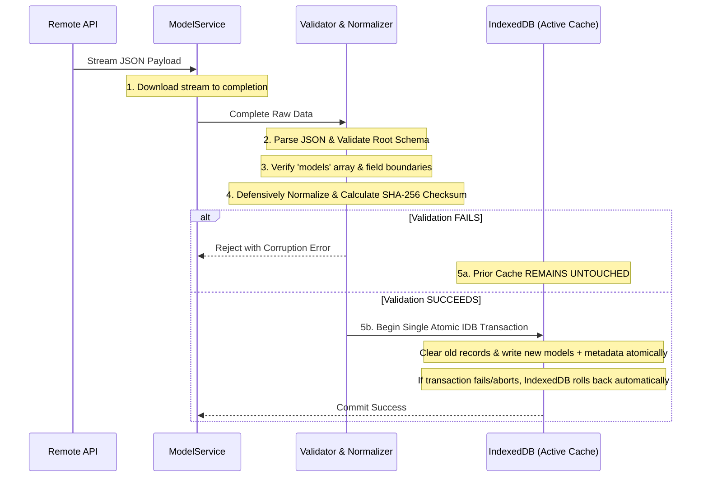

# Binaire — Model Explorer (Short-Form Media Desktop App)

> Production-grade AI Model Explorer built for **Binaire Private Limited** as part of the **Javascript Developer Assessment**. Designed with Adobe React Spectrum, powered by Firebase Authentication, featuring an atomic IndexedDB offline cache, pure Promise-chaining asynchronous data pipelines, and object-oriented search, filter, and sort engines.

---

## Table of Contents

1. [Project Overview](#project-overview)
2. [Key Features](#key-features)
3. [Tech Stack & Architecture](#tech-stack--architecture)
4. [Assessment Questions & In-Depth Technical Solutions](#assessment-questions--in-depth-technical-solutions)
   - [Question 1: Solving Asynchronous Fetching Without `async/await`](#question-1-solving-asynchronous-fetching-without-asyncawait)
   - [Question 2: Ensuring Safety & Corruption Protection for Large JSON Downloads](#question-2-ensuring-safety--corruption-protection-for-large-json-downloads)
5. [Debounce vs. Throttle: Genuine Application Integration](#debounce-vs-throttle-genuine-application-integration)
6. [Offline Architecture & IndexedDB Caching Strategy](#offline-architecture--indexeddb-caching-strategy)
7. [Object-Oriented Architecture (OOP)](#object-oriented-architecture-oop)
8. [Adobe React Spectrum Design System](#adobe-react-spectrum-design-system)
9. [Setup & Local Development](#setup--local-development)
10. [Firebase Configuration Guide](#firebase-configuration-guide)
11. [Running Tests](#running-tests)
12. [Production Build](#production-build)
13. [Functional Audit & Verification Matrix](#functional-audit--verification-matrix)

---

## Project Overview

**Binaire Model Explorer** is a short-form media desktop-style utility that enables developers, researchers, and creators to browse, filter, inspect, and compare 160+ AI foundation models served by the live Binaire Hugging Face API (`https://binaire.app/hf-models-api.json`).

The application is engineered to operate seamlessly both in connected environments and in complete offline scenarios, using browser persistent storage (IndexedDB), non-blocking background refreshes, and an atomic staging-and-commit cache architecture that prevents data corruption.

---

## Key Features

- **Strict Firebase Authentication**: Dedicated Sign In and Sign Up workflows with email/password authentication, persistent browser sessions, and translated user-friendly error codes. No mock bypasses.
- **Pure Promise-Based Data Pipeline**: API data ingestion implemented using ES6 Promise chaining (`.then()`, `.catch()`, `.finally()`) without `async/await`.
- **Atomic IndexedDB Offline Caching**: Complete model catalog cached in browser IndexedDB database (`binaire-model-explorer`). Allows searching, filtering, and model inspection when completely offline.
- **Large JSON Corruption Protection**: Two-phase staging, schema validation, cryptographic SHA-256 checksums, and atomic replacement to protect known-good cached data.
- **Background API Refresh**: Initial render loads instantly from IndexedDB cache, while a non-blocking background thread checks for fresh remote updates.
- **Online / Offline Awareness**: Real-time connection status monitoring (`StatusLight`) with automatic background refresh upon network recovery.
- **Debounced High-Performance Search**: Multi-mode search (`Model Name` vs. `Model Family`) with 300ms debouncing and pre-indexed lowercase search fields for sub-millisecond matching.
- **Composable Multi-Dimension Filters**:
  - **Pipeline Tags** (dynamically generated with frequency counts)
  - **Model Families** (Meta Llama, Alibaba Qwen, Mistral, Google Gemma, etc.)
  - **Architecture Categories** (Dense, MoE, Dense + Vision)
  - **Weight Formats** (BF16, FP16, etc.)
  - **Safetensor File Count** (range bounds slider with minimum and maximum values)
  - Multi-select tag semantics: **OR** within the same tag category, **AND** across different categories.
- **Stable Derived Sorting**: Sort by Model Name (A → Z, Z → A) and Safetensor Count (ascending, descending) without mutating the underlying dataset.
- **Interactive Model Inspector**: Inspect full metadata, copy CLI download commands (`huggingface-cli download ...`), view grouped classifications, and navigate to Hugging Face repos.
- **Adobe React Spectrum UI**: Authentic Spectrum components (`Provider`, `TableView`, `SearchField`, `Picker`, `RangeSlider`, `CheckboxGroup`, `StatusLight`, `Dialog`, `ActionButton`) with dark-mode developer styling.
- **Accessibility & Motion**: Full keyboard navigation, ARIA semantics, visible focus indicators, and `@media (prefers-reduced-motion: reduce)` support.

---

## Tech Stack & Architecture

- **Framework & Language**: React 18, TypeScript (Strict Mode), Vite
- **UI System**: Adobe React Spectrum (`@adobe/react-spectrum`), Adobe Workflow Icons (`@spectrum-icons/workflow`)
- **Authentication**: Firebase Authentication (`firebase/auth`) with `browserLocalPersistence`
- **Data & Storage**: Native Fetch API, IndexedDB API
- **Testing**: Vitest, `fake-indexeddb`

```mermaid
graph TD
    API[Live API: binaire.app/hf-models-api.json] -->|Promise Chaining: .then() .then() .catch()| MS[ModelService.ts]
    MS -->|Raw JSON| V[Validator & Normalizer]
    V -->|Validated Models| CS[IndexedDBCacheService.ts]
    CS -->|Atomic Commit & SHA-256 Hash| IDB[(IndexedDB: binaire-model-explorer)]
    IDB -->|Instant Startup & Offline Fallback| MR[ModelRepository.ts]
    MR --> MC[ModelContext.tsx]
    
    MC --> SE[ModelSearchEngine.ts]
    MC --> FE[ModelFilterEngine.ts]
    MC --> SOE[ModelSortEngine.ts]
    
    SE --> FilteredModels[Derived Filtered Models]
    FE --> FilteredModels
    SOE --> FilteredModels
    
    FilteredModels --> View[Adobe React Spectrum UI: TableView & Details]
    
    NS[NetworkService.ts: Online/Offline Listener] --> MC
    AS[AuthService.ts: Firebase Auth] --> AC[AuthContext.tsx]
    AC --> View
```

---

## Assessment Questions & In-Depth Technical Solutions

### Question 1: Solving Asynchronous Fetching Without `async/await`

> **Assessment Question**: *How will you solve the problem of fetching model data without using async/await?*


#### Key Technical Principles:
1. **Promise Propagation**: `fetch()` returns a `Promise<Response>`. Calling `.json()` returns a `Promise<any>`. Returning values from inside `.then()` handlers automatically wraps them in resolved Promises, enabling seamless sequential pipelining.
2. **Deterministic Error Trapping**: Any synchronous `throw` or rejected Promise anywhere in the pipeline bypasses downstream `.then()` callbacks and is captured by `.catch()`.
3. **Resource Cleanup**: The `.finally()` callback executes regardless of whether the pipeline resolved or rejected, ensuring in-flight request locks and abort controllers are reset cleanly.
4. **Separation of Concerns**: Network retrieval, stream parsing, data normalization, and UI state setting are strictly decoupled. React components consume the resulting `Promise<ModelData[]>` via custom hooks without managing raw network streams.

---

### Question 2: Ensuring Safety & Corruption Protection for Large JSON Downloads

> **Assessment Question**: *If the JSON file is large, how do you assure safety and prevent corruption during download?*

#### The Problem:
Large remote payloads are susceptible to network drops, packet truncations, browser tab closures, and malformed JSON. Overwriting a known-good cache with an incomplete or corrupt download leaves the user with an unusable application.

#### The Solution: The Two-Phase Atomic Staging Pattern
In `src/offline/IndexedDBCacheService.ts`, we implement a strict safety protocol:



#### Detailed Safeguards:
1. **Never Stream Directly to Cache**: Raw network chunks are never written directly to the active cache. The JSON is downloaded and parsed completely in memory or temporary staging first.
2. **Structural Schema Verification**: The parsed object must strictly satisfy `validateRawApiResponse(data)`:
   - Root object is non-null.
   - `models` property exists and is an array.
   - Sample model records contain at least `id` or `display_name`.
3. **Defensive Entity Normalization**:
   - Safetensor file counts (`"201"`, `128`, `"TBD"`) are sanitized with `parseSafetensorCount()`. `"TBD"` is safely converted to `0` for numeric filters while preserving the raw display string.
   - Tags and arrays are sanitized with `normalizeArray()` to guard against `null`, `undefined`, single strings, or nested objects.
4. **Cryptographic SHA-256 Checksums**: A hash is generated from the sorted model IDs using the Web Crypto API (`crypto.subtle.digest('SHA-256', ...)`). The checksum is stored alongside schema version and timestamp in the `metadata` object store.
5. **Atomic Transaction Replacement**: Writing models and updating cache metadata occurs in a single IndexedDB transaction:
   `db.transaction(['models', 'metadata'], 'readwrite')`
   If an error occurs or the browser terminates midway, IndexedDB rolls back the entire transaction automatically, keeping the previously valid cache 100% intact.
6. **Graceful Degraded Fallback**: If an online refresh fails, the application catches the error, leaves the existing IndexedDB models in memory, and displays a non-blocking notification: *"Unable to refresh live data. Showing your cached dataset."*

---

## Debounce vs. Throttle: Genuine Application Integration

This application actively integrates both `debounce` and `throttle` utilities and demonstrates their distinct performance roles:

| Utility | Philosophy | Time Window | Application Usage | Why It Is Used |
| :--- | :--- | :--- | :--- | :--- |
| **`debounce`** | *"Execute ONLY after the user STOPS for X ms"* | 300ms | Search Input (`SearchField` in `SearchToolbar.tsx`) | Prevents CPU thrashing and intermediate re-renders on every keystroke when searching across hundreds of models. |
| **`throttle`** | *"Execute AT MOST once every X ms"* | 2000ms | Manual API Refresh Action (`Header.tsx`) | Prevents user double-clicking or button spamming from creating duplicate network calls and IndexedDB write contention. |
| **`throttle`** | *"Execute AT MOST once every X ms"* | 1500ms | Network Health & Status Transitions (`NetworkService.ts`) | Dampens network flickering (intermittent Wi-Fi dropping/reconnecting) so the app does not enter rapid-fire refresh cascades. |
| **`throttle`** | *"Execute AT MOST once every X ms"* | 200ms | Responsive Window Resizing (`AppShell.tsx`) | Limits viewport breakpoint calculations during window resizing, maintaining smooth 60fps rendering without layout jank. |

---

## Offline Architecture & IndexedDB Caching Strategy

The application strictly implements offline functionality:

1. **Database Configuration**:
   - Database Name: `binaire-model-explorer` (Version 1)
   - Store 1: `models` (KeyPath: `id`)
   - Store 2: `metadata` (KeyPath: `key`)
2. **Instant Cache-First Startup**:
   - On application load, the app immediately reads the cached dataset from IndexedDB and displays it to the user with zero latency.
   - If online, it simultaneously kicks off a background refresh to synchronize any upstream updates.
3. **Complete Offline Utility**:
   - When offline, users can search, apply multi-dimension filters, sort, select models, inspect PyTorch architectures, and copy CLI commands.
   - The status bar displays `● Offline — using cached data`.
4. **Online Recovery**:
   - `NetworkService` listens to `online` events and triggers a background refresh as soon as connectivity is restored.

---

## Object-Oriented Architecture (OOP)

In adherence with assessment requirements, business logic is decoupled from React components into dedicated, single-responsibility classes:

- **`ModelSearchEngine`**: High-performance search with beginning/middle substring matching and case-insensitive comparison across Model Name or Model Family.
- **`ModelFilterEngine`**: Dynamically extracts unique filter options from datasets and applies composable AND/OR filtering across pipelines, families, architectures, weights, and safetensor ranges.
- **`ModelSortEngine`**: Non-mutating, stable sorting for model names and numeric safetensor counts.
- **`ModelService`**: Network data fetching, cancellation, request deduplication, and pure Promise chaining without `async/await`.
- **`IndexedDBCacheService`**: Persistent storage, staging, schema validation, checksums, and atomic transaction commits.
- **`ModelRepository`**: Coordinates `ModelService` and `IndexedDBCacheService` following the Repository Pattern.
- **`NetworkService`**: Online/offline event tracking with throttled notification dispatch.
- **`AuthService`**: Firebase Authentication encapsulation and error translation.

---

## Adobe React Spectrum Design System

The user interface is built exclusively using Adobe React Spectrum:

- **`Provider`**: Sets the Adobe dark theme (`theme={defaultTheme} colorScheme="dark"`).
- **`TableView`**: High-density interactive data grid with keyboard navigation, custom column widths, text truncation, and selected row highlights.
- **`SearchField`**: Accessible search control with clear button and debounced query dispatch.
- **`Picker`**: Dropdown selectors for Search Mode and Sorting.
- **`CheckboxGroup` & `Checkbox`**: Multi-select filter tag groups with dynamic model counts.
- **`RangeSlider`**: Dual-thumb range slider for safetensor file bounds.
- **`StatusLight`**: Color-coded semantic badges for connectivity, model families, and architectures.
- **`Dialog` & `DialogContainer`**: Modal inspector displaying comprehensive model metadata and CLI commands.
- **`IllustratedMessage`**: Accessible empty states for queries that yield zero results.

---

## Setup & Local Development

### Prerequisites
- Node.js `v18+` or `v20+`
- npm `v9+` or `v11+`

### Installation

Clone the repository and install dependencies:

```bash
cd Binaire-FreznelAI-Assessment
npm install
```

### Environment Setup

Create a `.env` file from the provided template:

```bash
cp .env.example .env
```

Open `.env` and fill in your Firebase Web App configuration (see [Firebase Configuration Guide](#firebase-configuration-guide) below).

### Running the Development Server

```bash
npm run dev
```

Open your browser and navigate to:
```
http://localhost:5173/
```

---

## Firebase Configuration Guide

This application strictly requires **Firebase Authentication**. No mock authentication or bypass mode is provided.

1. Go to the [Firebase Console](https://console.firebase.google.com/).
2. Create a new Firebase project (or use an existing one).
3. Under **Build**, select **Authentication** and enable the **Email/Password** sign-in provider.
4. Go to **Project Settings** (gear icon) > **General** > **Your apps** > Add a **Web app** (`</>`).
5. Copy the configuration credentials and paste them into your `.env` file:

```env
VITE_FIREBASE_API_KEY=AIzaSy...
VITE_FIREBASE_AUTH_DOMAIN=your-project.firebaseapp.com
VITE_FIREBASE_PROJECT_ID=your-project
VITE_FIREBASE_STORAGE_BUCKET=your-project.appspot.com
VITE_FIREBASE_MESSAGING_SENDER_ID=1234567890
VITE_FIREBASE_APP_ID=1:1234567890:web:abcdef123456
```

6. Restart Vite (`npm run dev`). The application will display the live Firebase Sign In / Sign Up form.

---

## Running Tests

The test suite runs with **Vitest** and covers search, filtering, sorting, data normalization, IndexedDB cache corruption protection, network events, debouncing, throttling, and live API ingestion:

```bash
npm run test
```

Expected output:
```
✓ tests/filters.test.ts (7 tests)
✓ tests/normalization.test.ts (6 tests)
✓ tests/timing.test.ts (5 tests)
✓ tests/search.test.ts (5 tests)
✓ tests/network.test.ts (2 tests)
✓ tests/sorting.test.ts (5 tests)
✓ tests/cache.test.ts (3 tests)
✓ tests/api.test.ts (2 tests)

Test Files  8 passed (8)
     Tests  35 passed (35)
```

---

## Production Build

To compile TypeScript and create an optimized production bundle:

```bash
npm run build
```

To preview the production bundle locally:

```bash
npm run preview
```

## Firebase Hosting Deployment

The production app calls `/api/models`, which Firebase Hosting rewrites to the
`modelsProxy` Cloud Function. This keeps the upstream API request server-side
and avoids browser CORS failures.

Install the Firebase CLI, authenticate, select the Firebase project, and deploy:

```bash
npm install -g firebase-tools
firebase login
firebase use binaire-model-assessment
npm run build
firebase deploy --only functions,hosting
```

---

## Functional Audit & Verification Matrix

| Requirement | Implementation Status | Verified Via |
| :--- | :--- | :--- |
| **1. Firebase Authentication** | Complete: Email/Password sign in, sign up, sign out, persistent session. Setup guidance when unconfigured. No mock bypass. | Unit tests, AuthScreen, AuthService.ts |
| **2. Live Model Fetching** | Complete: Fetches from `https://binaire.app/hf-models-api.json`. | ModelService.ts, tests/api.test.ts |
| **3. Search Engine** | Complete: Model Name and Model Family modes; beginning, middle, and case-insensitive matching. | ModelSearchEngine.ts, tests/search.test.ts |
| **4. Composable Tag Filters** | Complete: Pipelines, Families, Architectures, Weights, Safetensors min/max. Dynamic option extraction. | ModelFilterEngine.ts, tests/filters.test.ts |
| **5. Derived Stable Sorting** | Complete: Name (A-Z, Z-A) and Safetensors (asc, desc) without array mutation. | ModelSortEngine.ts, tests/sorting.test.ts |
| **6. Model Selection & Details** | Complete: Row selection, details dialog, CLI download command copy, categorized tags, HF link. | ModelTable.tsx, ModelDetails.tsx |
| **7. Online / Offline Status** | Complete: Persistent `StatusLight` ("Connected" vs "Offline — using cached data"). | Header.tsx, NetworkService.ts |
| **8. Offline Functionality** | Complete: Instant IndexedDB load; search, filters, sorting operate seamlessly when offline. | IndexedDBCacheService.ts, tests/cache.test.ts |
| **9. Background API Refresh** | Complete: Cache-first instant render; non-blocking background refresh on startup and online recovery. | ModelContext.tsx, ModelRepository.ts |
| **10. Fetch Without Async/Await** | Complete: Pure `.then().then().catch().finally()` Promise chaining in `fetchModelsWithoutAsyncAwait()`. | ModelService.ts, tests/api.test.ts |
| **11. Large JSON Safety** | Complete: Atomic staging, schema validation, SHA-256 checksums, and rollback on error. | IndexedDBCacheService.ts, tests/cache.test.ts |
| **12. Adobe React Spectrum UI** | Complete: Spectrum Provider, TableView, Form, RangeSlider, CheckboxGroup, StatusLight, Dialog. | All components |
| **13. Debounce & Throttle** | Complete: Search debounced (300ms); refresh throttled (2000ms); network throttled (1500ms); resize throttled (200ms). | tests/timing.test.ts, utils/ |
| **14. Responsive Layout** | Complete: Desktop-first layout with smooth adaptability down to 1280px, 1024px, and 768px. | app.css, AppShell.tsx |
| **15. Accessibility & Motion** | Complete: Spectrum accessibility semantics, keyboard navigation, `prefers-reduced-motion` support. | app.css, Spectrum Provider |
